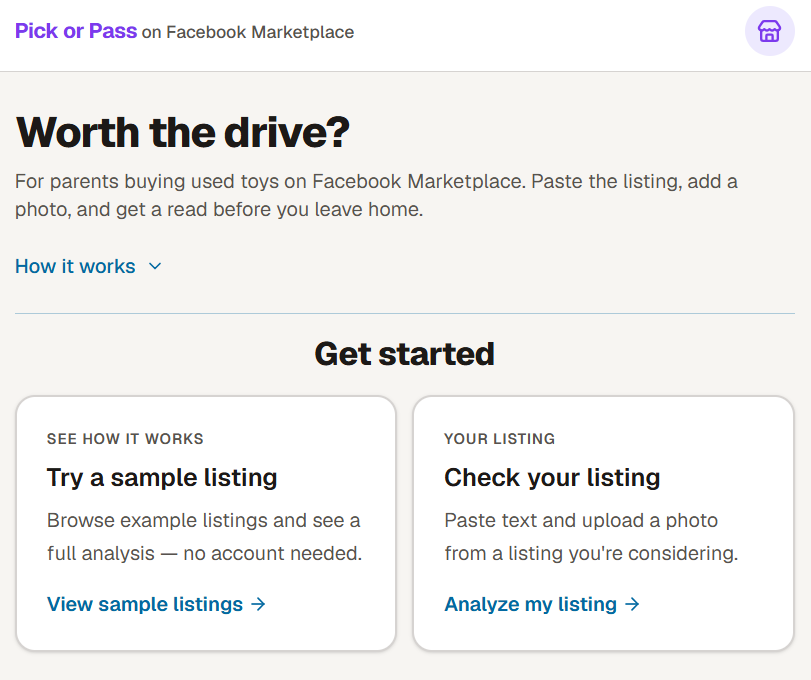
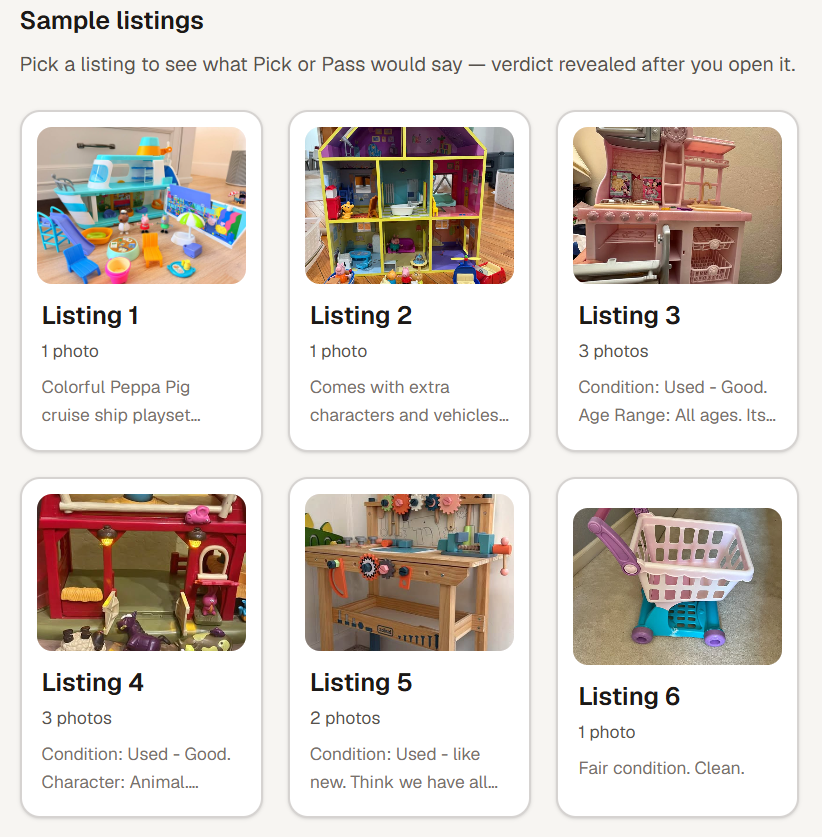
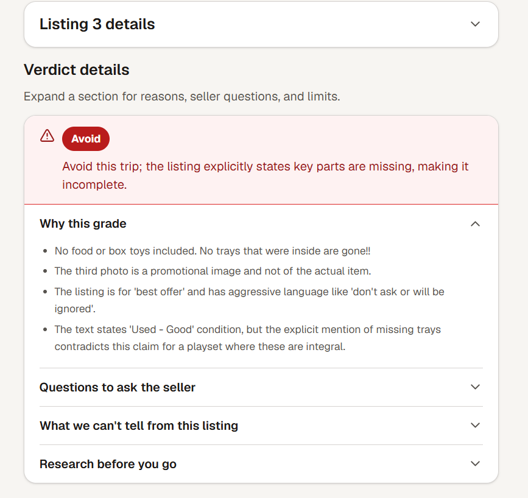
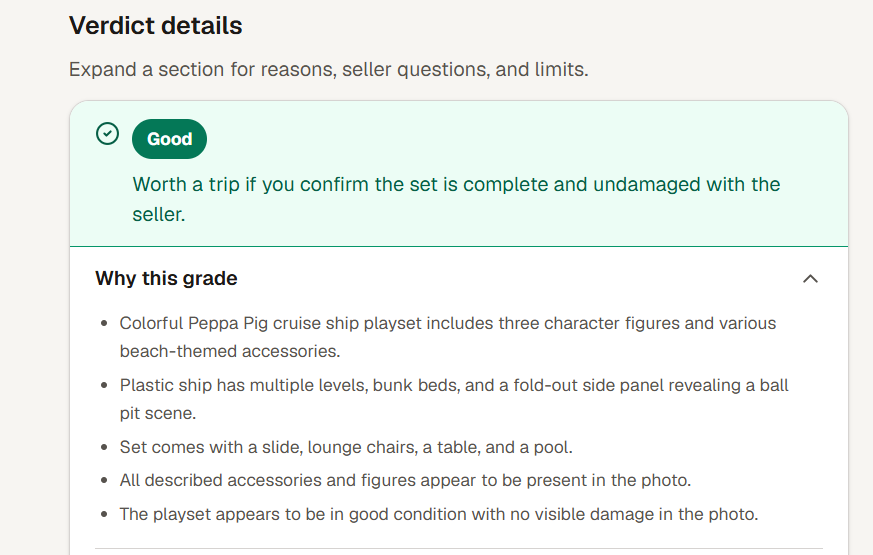
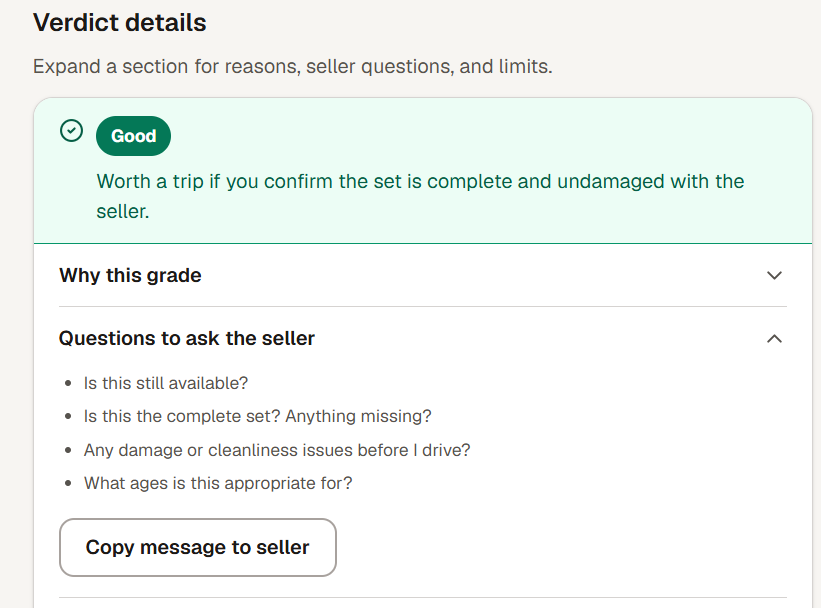

# Pick or Pass — Visit-worthiness checker for used toy listings

**One-line outcome:** Parents paste a Facebook Marketplace listing and get Good / Not sure / Avoid before they drive.

## Snapshot

**Product:** [Pick or Pass](https://pick-or-pass-seven.vercel.app/) — multimodal web app for Facebook Marketplace used-toy listings

**Target user:** Parent buying second-hand toys (ages 3–10) on Facebook Marketplace

**Problem:** Listings look fine online but fail in person — wasted trips, vague text, photos that hide damage or missing parts

**AI capability:** Multimodal analysis (text + photos), structured JSON output, prompt guardrails, eval-driven quality loop

**Status:** Shipped v1 (May 2026)

**Demo:** https://pick-or-pass-seven.vercel.app/

**Repo:** https://github.com/nishanthkadi/pick-or-pass

## Why I Built This

Parents already use ChatGPT for listing advice, but they re-explain context every session, get inconsistent formats, and can't rely on a single photo upload workflow. The pain is **trip-worthiness**, not product research — "should I drive for this?"

Pick or Pass encodes parent + Marketplace + toy context once, requires both text and photos, and always returns the same structure: grade, visit summary, reasons, seller questions, and honest limits.

## Product Approach

**Core flow:** Landing → sample listings (zero API cost) or paste-your-own → unified results with collapsed listing details and expandable verdict sections.

**Key tradeoffs (v1):**

| Ship | Defer |
|------|-------|
| Good / Not sure / Avoid grades | Web research, recalls, price verification |
| 6 cached sample listings | User accounts |
| Server key + rate limits + BYOK | Browser extension |
| Eval set from real Marketplace listings | Fine-tuning |

**UX decisions that mattered:**

- Sample tiles hide the grade until click — users discover the verdict, not spoilers
- Listing details collapsed by default — verdict + "expand for reasons" stays above the fold
- Verdict merged into one **Verdict details** card — less scrolling, clearer hierarchy

## AI Approach

- **Model:** Gemini 2.5 Flash Lite (multimodal, structured JSON via schema)
- **Prompt design:** Grade ↔ alignment binding (e.g. `contradicts` → Avoid), photo-first inspection for structural damage, calibration examples from real failure cases
- **Guardrails:** No hype, no proximity-as-signal, no "avoid at all costs" — visit-worthiness framing only
- **What we don't claim:** Seller trust, recalls, exact retail price, or in-person condition guarantees

## What I Built

- **Next.js app** on Vercel (`app/`) — landing, 6 sample demos, live analyze API
- **Eval infrastructure** — `eval/dataset.jsonl` (6 real listings), golden outputs, rubric scorer, `--score-only` / `--no-sync` CLI
- **Prompt iteration** — 6/6 grade match after tuning for visible damage, incomplete sets, and missing-price cases

Stack: Next.js App Router, TypeScript, Tailwind, Gemini API, Vercel Hobby.

## Metrics & Evaluation

Built a labeled eval set before prompt tweaking (not after vibes):

| Grade | Cases | Example signal |
|-------|-------|----------------|
| Good | 2 | Strong text-photo match, retail screenshot or detail |
| Not sure | 2 | Sparse text or no price / unverified features |
| Avoid | 2 | Structural damage, severely incomplete set |

**Results:** 6/6 grade match after prompt iteration. Rubric scorer checks themes, seller questions, visit summary, and guardrails for regression.

## What I Learned

- **Eval cases should come from real listings first** — synthetic examples missed patterns like promo-photo mismatch and "fair/clean" text with visible cracks
- **Models hedge to Not sure** unless prompts explicitly forbid downgrading Avoid when damage is visible in photos
- **Cached demos are a product feature** — portfolio visitors and sample flow don't burn API quota
- **Deployment is part of the product** — env vars, rate limits, and public URL change how you think about abuse and cost

## What I Would Do Next

1. Persistent rate limiting (Upstash) for production scale
2. Expand eval set + wire rubric pass rate into CI
3. v2: listing URL paste, optional recall/price research (RAG or tools)
4. Chrome extension only after paste workflow is validated

## Assets

### Screenshots

### Links

- **Live demo:** https://pick-or-pass-seven.vercel.app/
- **GitHub:** https://github.com/nishanthkadi/pick-or-pass
- **Project docs:** repo root (`00_Brief.md`, `04_Build_Notes.md`, `06_Retrospective.md`)
